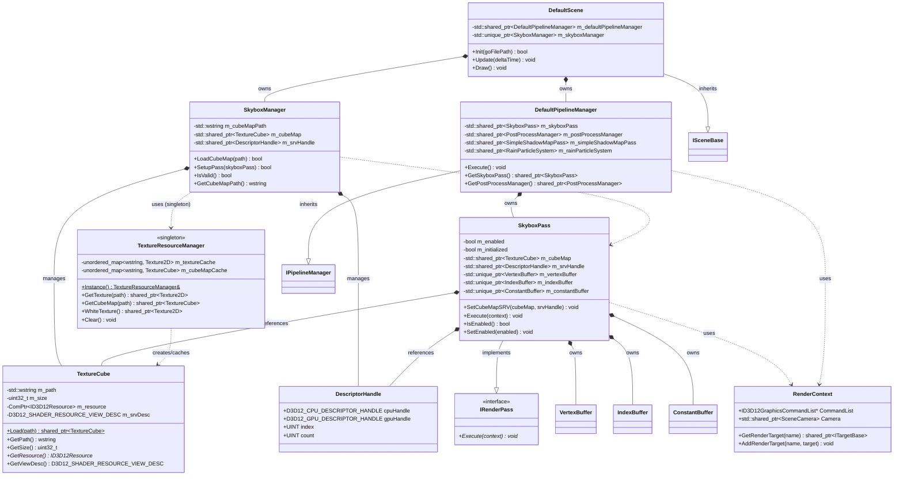

# Skybox実装 クラス図

## 概要
キューブマップを使用したSkybox実装のクラス構造と関係性を示す。

## クラス図

```mermaid
classDiagram
    class DefaultScene {
        -std::shared_ptr~DefaultPipelineManager~ m_defaultPipelineManager
        -std::unique_ptr~SkyboxManager~ m_skyboxManager
        +Init(goFilePath) bool
        +Update(deltaTime) void
        +Draw() void
    }

    class SkyboxManager {
        -std::wstring m_cubeMapPath
        -std::shared_ptr~TextureCube~ m_cubeMap
        -std::shared_ptr~DescriptorHandle~ m_srvHandle
        +LoadCubeMap(path) bool
        +SetupPass(skyboxPass) bool
        +IsValid() bool
        +GetCubeMapPath() wstring
    }

    class SkyboxPass {
        -bool m_enabled
        -bool m_initialized
        -std::shared_ptr~TextureCube~ m_cubeMap
        -std::shared_ptr~DescriptorHandle~ m_srvHandle
        -std::unique_ptr~VertexBuffer~ m_vertexBuffer
        -std::unique_ptr~IndexBuffer~ m_indexBuffer
        -std::unique_ptr~ConstantBuffer~ m_constantBuffer
        +SetCubeMapSRV(cubeMap, srvHandle) void
        +Execute(context) void
        +IsEnabled() bool
        +SetEnabled(enabled) void
    }

    class TextureCube {
        -std::wstring m_path
        -uint32_t m_size
        -ComPtr~ID3D12Resource~ m_resource
        -D3D12_SHADER_RESOURCE_VIEW_DESC m_srvDesc
        +Load(path)$ shared_ptr~TextureCube~
        +GetPath() wstring
        +GetSize() uint32_t
        +GetResource() ID3D12Resource*
        +GetViewDesc() D3D12_SHADER_RESOURCE_VIEW_DESC
    }

    class TextureResourceManager {
        <<singleton>>
        -unordered_map~wstring, Texture2D~ m_textureCache
        -unordered_map~wstring, TextureCube~ m_cubeMapCache
        +Instance()$ TextureResourceManager&
        +GetTexture(path) shared_ptr~Texture2D~
        +GetCubeMap(path) shared_ptr~TextureCube~
        +WhiteTexture() shared_ptr~Texture2D~
        +Clear() void
    }

    class DefaultPipelineManager {
        -std::shared_ptr~SkyboxPass~ m_skyboxPass
        -std::shared_ptr~PostProcessManager~ m_postProcessManager
        -std::shared_ptr~SimpleShadowMapPass~ m_simpleShadowMapPass
        -std::shared_ptr~RainParticleSystem~ m_rainParticleSystem
        +Execute() void
        +GetSkyboxPass() shared_ptr~SkyboxPass~
        +GetPostProcessManager() shared_ptr~PostProcessManager~
    }

    class IRenderPass {
        <<interface>>
        +Execute(context)* void
    }

    class RenderContext {
        +ID3D12GraphicsCommandList* CommandList
        +std::shared_ptr~SceneCamera~ Camera
        +GetRenderTarget(name) shared_ptr~ITargetBase~
        +AddRenderTarget(name, target) void
    }

    class DescriptorHandle {
        +D3D12_CPU_DESCRIPTOR_HANDLE cpuHandle
        +D3D12_GPU_DESCRIPTOR_HANDLE gpuHandle
        +UINT index
        +UINT count
    }

    %% 継承関係
    DefaultScene --|> ISceneBase : inherits
    DefaultPipelineManager --|> IPipelineManager : inherits
    SkyboxPass --|> IRenderPass : implements

    %% 所有関係（コンポジション）
    DefaultScene *-- SkyboxManager : owns
    DefaultScene *-- DefaultPipelineManager : owns
    DefaultPipelineManager *-- SkyboxPass : owns
    SkyboxManager *-- TextureCube : manages
    SkyboxManager *-- DescriptorHandle : manages
    SkyboxPass *-- TextureCube : references
    SkyboxPass *-- DescriptorHandle : references
    SkyboxPass *-- VertexBuffer : owns
    SkyboxPass *-- IndexBuffer : owns
    SkyboxPass *-- ConstantBuffer : owns

    %% 使用関係（依存）
    SkyboxManager ..> TextureResourceManager : uses (singleton)
    SkyboxManager ..> SkyboxPass : configures
    SkyboxPass ..> RenderContext : uses
    TextureResourceManager ..> TextureCube : creates/caches
    DefaultPipelineManager ..> RenderContext : uses
```